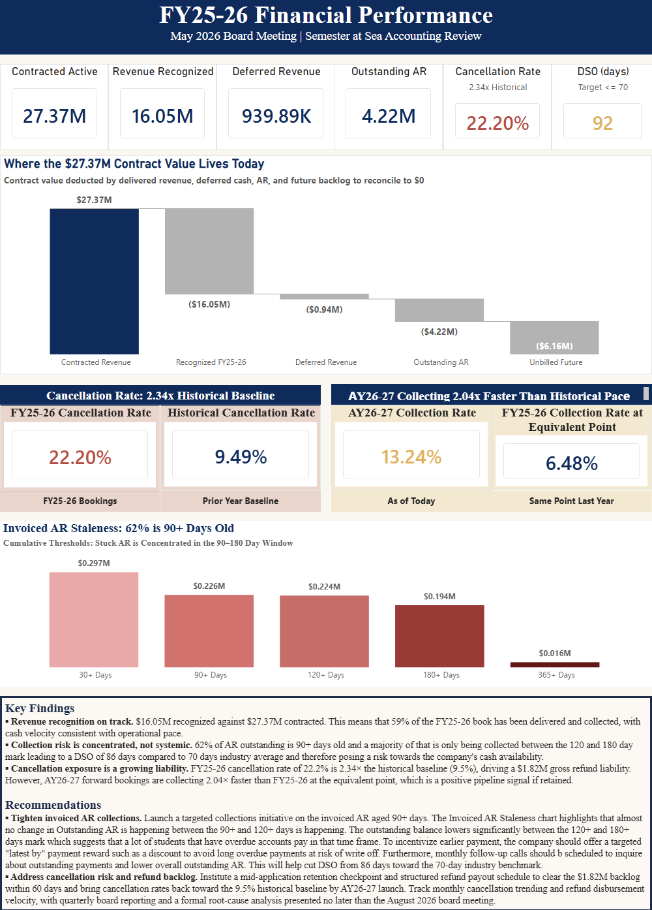

## FY25-26 Financial Performance Dashboard

Executive-style Power BI report built to support a board-level financial review for a real-world organization, summarizing FY25-26 performance and surfacing forward-looking risk and pipeline signals. Designed for a May 2026 Board Meeting, the report combines KPI summary tiles, a waterfall reconciliation, and aging analysis with a written findings-and-recommendations narrative.

### Report Design
The report is structured as a single-page executive summary with the following components:
- KPI Summary Tiles
- Contract Value Waterfall reconciling to zero
- Cancellation Rate comparison against the prior-year baseline
- Collection Velocity Comparison — Shows AY26-27 collections against FY25-26 at equivalent calendar point
- Invoiced AR Staleness — Cumulative aging thresholds highlighting where stuck receivables are concentrated
- Findings & Recommendations Narrative — Translating the visuals into action items for finance leadership

### Key Insights
- Revenue recognition on track. $16.05M recognized against $27.37M contracted. 59% of the FY25-26 book has been delivered and collected, with cash velocity consistent with operational pace.
- Collection risk is concentrated, not systemic. 62% of outstanding AR is 90+ days old, with the majority collecting between days 120 and 180. DSO sits at 86 days against a 70-day industry benchmark, indicating a fixable timing problem rather than a structural one.
- Cancellation exposure is a growing liability. FY25-26 cancellation rate of 22.2% is 2.34× the historical baseline of 9.5%, driving a $1.82M gross refund liability. AY26-27 forward bookings are collecting 2.04× faster at the equivalent point, a positive pipeline signal worth protecting.

### Tools & Methods
- Power BI — report design, semantic model, slicers, conditional formatting
- Power Query Editor — data cleaning, table merges, schema and type standardization
- Data Modeling — semantic model with table relationships supporting cross-filtering and dynamic slicers
- DAX — measures for dynamic calculations and custom calculated columns for row-level logic
